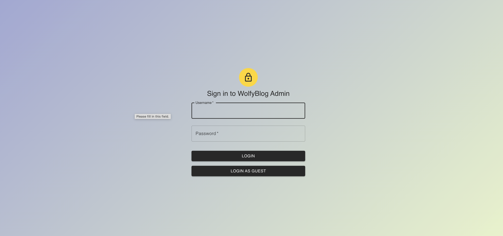
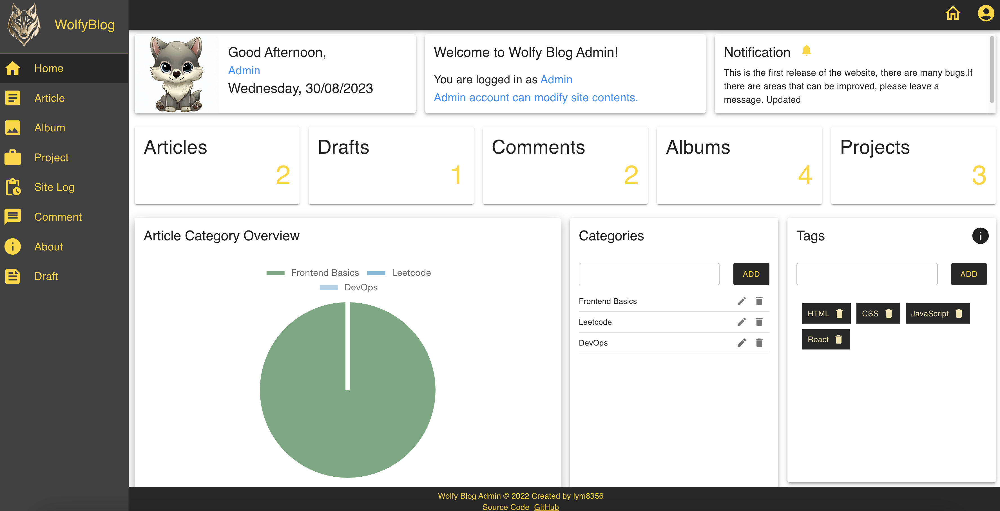
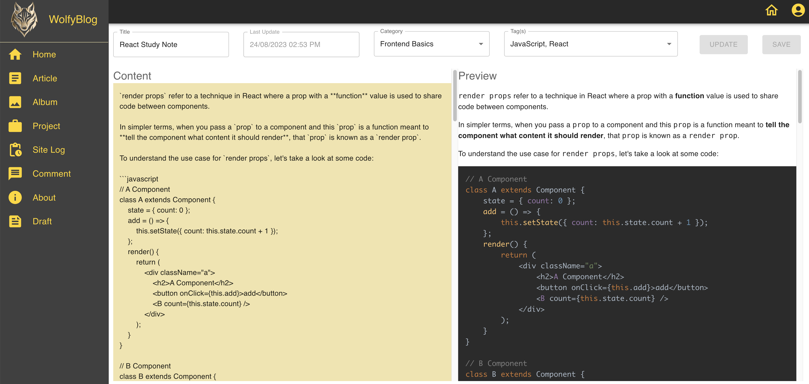
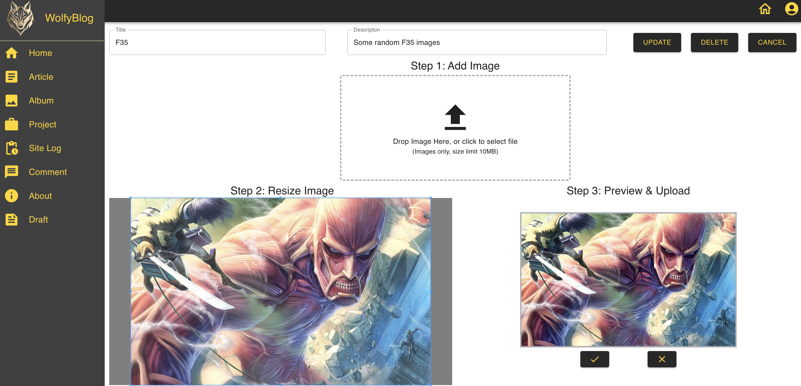
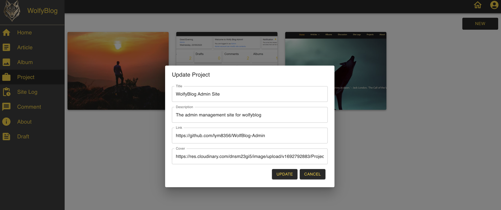
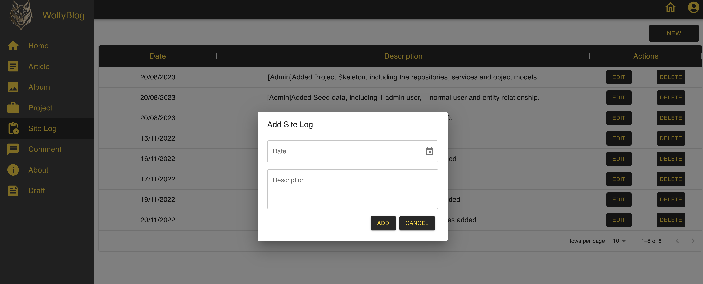
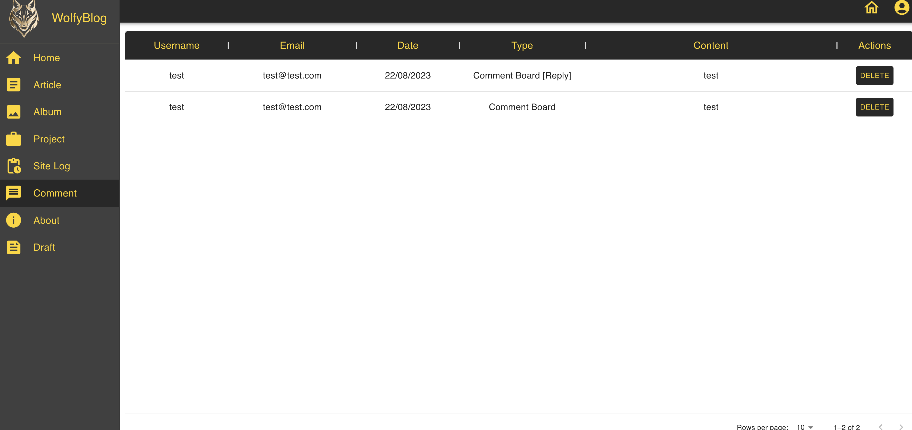
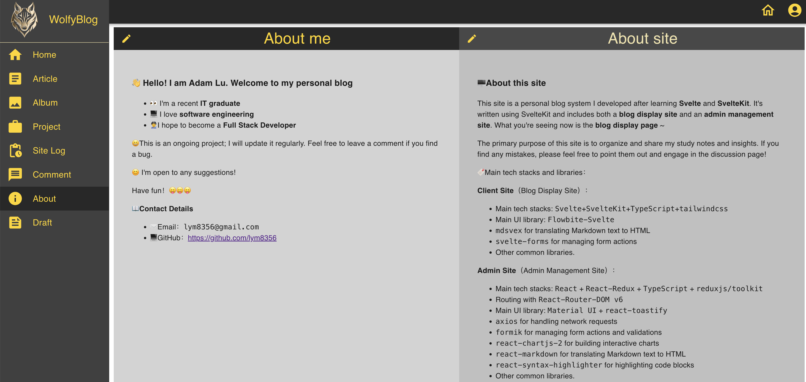

# WolfyBlog-Admin

An admin management site for WolfyBlog built using React and TypeScript.

# Description

This project serves as the admin portal for managing content on WolfyBlog. It's equipped with several features, including visual data representation and a suite of CRUD operations tailored for WolfyBlog. A key focus is ensuring security through JWT tokens, alongside capabilities like image management via Cloudinary.

> Note: This project isn't designed for responsiveness. Dedicated applications for iOS and Android will be developed separately.

# Technologies Used

- React (v18.2.0) with TypeScript
- CSS (Styled with @emotion/react and @emotion/styled)
- MUI (v5.10.14) with icons, lab components, data grid, and date pickers
- Redux (v4.2.0) with the Redux Toolkit (v1.9.0)
- Formik (v2.2.9) for form handling
- Axios (v1.1.3) for HTTP requests
- Chart.js (v4.0.1) and react-chartjs-2 (v5.0.1) for visual data representation
- moment (v2.29.4) for date and time handling
- react-markdown (v8.0.4) and react-syntax-highlighter (v15.5.0) for markdown - rendering and syntax highlighting
- react-toastify (v9.1.1) for notifications
- yup (v0.32.11) for schema validations
- And many more...

# Features

- Display data in table and graph formats.
- Provide CRUD functionality for WolfyBlog.
- Enhance security using JWT tokens.
- Drop and upload images using Cloudinary.
- Use Material UI as the primary UI library.

# Screenshots

  
  

  
  

  
  

  
  

# Setup
## Getting Started with Create React App

This project was bootstrapped with Create React App.

### Available Scripts
- `npm start`: Runs the app in development mode at **http://localhost:3000**.
- `npm test`: Launches the test runner in watch mode.
- `npm run build`: Builds the app for production to the `build` folder.
- `npm run eject`: Ejects from the CRA setup. Use with caution!

# Project Status
- The project is currently in progress and will be updated regularly.

# Improvements
- Fix the issue where refreshing on a nested route causes the app to crash.
- Resolve the problem with popup form state not updating after submission.

# Future Enhancements
- When editing or creating an article, make both preview and content scroll at the same time
- Add Profile page to allow admin user to change password and profile details